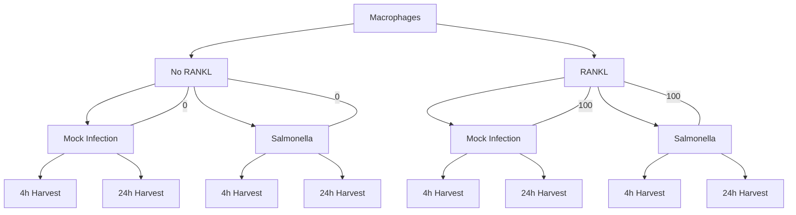

# RANKL singaling in macrophages

## Experiment structure:
The samples are all macrophages that received no RANKL (0) or RANKL (100) for 2 days prior to mock infection or Salmonella infection (STm). They were either infected for 4h or 24h before samples were harvested. 



So there were total 8 experimental conditions. 

* 4h_mock_0 
* 24h_mock_0
* 4h_STm_0
* 24h_STm_0
* 4h_mock_100
* 24h_mock_100
* 4h_STm_100
* 24h_STm_100
An each condition had 3 technical replicates

## Preprocessing 
Preprocessing was done before by a PhD student using Kallisto / Sleuth-normalization. We are considering rerunning the pipeline with STAR. 


## Main interest:
The main interest is how RANKL impacts the innate immune response to infection. Biologically, I have seen decreases in TLR and NFkB pathways, and associated decreases in proinflammatory cytokines.

## Statistical Modelling 
To model the experiment in mathematical terms, I`m going to set the following contrasts: 
```
RANKL_effect_4h = (t4h_STm_100 - t4h_mock_100) - (t4h_STm_0 - t4h_mock_0),
RANKL_effect_24h = (t24h_STm_100 - t24h_mock_100) - (t24h_STm_0 - t24h_mock_0),
Time_RANKL_effect = ((t24h_STm_100 - t24h_mock_100) - (t24h_STm_0 - t24h_mock_0)) - ((t4h_STm_100 - t4h_mock_100) - (t4h_STm_0 - t4h_mock_0)),
```
Basically speaking, the `-` sign sets the comparison between two conditions. This helps us to isolate specific biological effects we`re interested in. 

### Early infection RANKL effect 
`RANKL_effect_4h = (4h_STm_100 - 4h_mock_100) - (4h_STm_0 - 4h_mock_0)`
* This shows how RANKL changes the infection response at 4 hours
* Think of it as: "Does RANKL treatment make cells respond differently to infection (Salmonella) at 4h?"
* In mathematical terms:
    - First, we calculate infection effect with RANKL (4h_STm_100 - 4h_mock_100)
    - Then, infection effect without RANKL (4h_STm_0 - 4h_mock_0)
    - The difference between these tells us if RANKL modified the infection response
* It compares the infection response (STm vs mock) between RANKL-treated and untreated cells at 4 hours
* Identifies genes where RANKL changes the early infection response

### Late infection RANKL effect 
`RANKL_effect_24h = (24h_STm_100 - 24h_mock_100) - (24h_STm_0 - 24h_mock_0)`
* Same as above, but at 24 hours
* Answers: "Does RANKL treatment make cells respond differently to infection at 24h?"
Uses the same mathematical logic, just with 24h samples
* It compares the infection response (STm vs mock) between RANKL-treated and untreated cells at 24 hours
* Identifies genes where RANKL changes the late infection response

### RANKL time effect 
`Time_RANKL_effect = ((24h_STm_100 - 24h_mock_100) - (24h_STm_0 - 24h_mock_0)) - ((4h_STm_100 - 4h_mock_100) - (4h_STm_0 - 4h_mock_0))`
* This shows how the RANKL effect on infection changes between 4h and 24h
* Answers: "Does RANKL's impact on infection response change over time?"
* Mathematically:
    - Calculate RANKL effect at 24h
    - Calculate RANKL effect at 4h
    - Subtract to see if the effect changes over time
* Identifies genes where RANKL's modification of the infection response differs between early and late timepoints
* Positive values indicate genes where RANKL's effect on infection response is stronger at 24h
* Negative values indicate genes where RANKL's effect on infection response is stronger at 4h


