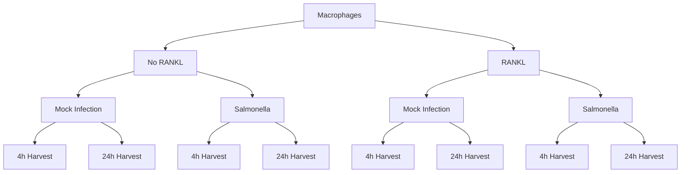

# RANKL Signaling in Macrophages

This repository contains the bulk RNA-seq analysis pipeline used to explore the effects of **RANKL signaling** on the **innate immune response** of macrophages to *Salmonella* infection. The analysis is performed in **R**, with a focus on both **differential expression** and **gene set enrichment analysis (GSEA)** to uncover pathway-level responses.

## 🧪 Experimental Design

All samples are murine macrophages treated with either **no RANKL (0)** or **100 ng/mL RANKL** for 48 hours prior to mock infection or *Salmonella Typhimurium* (STm) infection. Cells were harvested at either **4 hours** or **24 hours** post-infection. Each condition was run in **triplicate**.



### 📊 Experimental Conditions (n = 8 groups, 3 replicates each)

- `4h_mock_0`  
- `24h_mock_0`  
- `4h_STm_0`  
- `24h_STm_0`  
- `4h_mock_100`  
- `24h_mock_100`  
- `4h_STm_100`  
- `24h_STm_100`  

---


## 🧬 Biological Objective

The main question is: **How does RANKL modulate the macrophage response to infection?**

Previous biological findings suggest RANKL **dampens pro-inflammatory signaling** (e.g., TLR/NF-κB pathways). This pipeline quantifies those effects at the transcriptional and pathway level, across timepoints.

---

## 🧠 Statistical Design & Contrasts

We define **specific contrasts** to isolate the biological effects of interest:
## Statistical Modelling 
To model the experiment in mathematical terms, I`m going to set the following contrasts: 

#### 🧮 Defining Contrasts

```r
contrasts.p <- makeContrasts(
    STm_4h_0 = t4h_STm_0 - t4h_mock_0,
    STm_4h_100 = t4h_STm_100 - t4h_mock_100,
    RANKL_4h_mock = t4h_mock_100 - t4h_mock_0,
    RANKL_4h_STm = t4h_STm_100 - t4h_STm_0,
    STm_24h_0 = t24h_STm_0 - t24h_mock_0,
    STm_24h_100 = t24h_STm_100 - t24h_mock_100,
    RANKL_24h_mock = t24h_mock_100 - t24h_mock_0,
    RANKL_24h_STm = t24h_STm_100 - t24h_STm_0,
    levels = design
)
```
These contrasts look at **baseline** RANKL and infection effects for each timepoint.

```r
contrasts.m <- makeContrasts(
    RANKL_effect_4h = (t4h_STm_100 - t4h_mock_100) - (t4h_STm_0 - t4h_mock_0),
    RANKL_effect_24h = (t24h_STm_100 - t24h_mock_100) - (t24h_STm_0 - t24h_mock_0),
    Time_RANKL_effect = ((t24h_STm_100 - t24h_mock_100) - (t24h_STm_0 - t24h_mock_0)) -
                        ((t4h_STm_100 - t4h_mock_100) - (t4h_STm_0 - t4h_mock_0)),
    levels = design
)
```
These **granular contrasts** isolate how **RANKL** modulates infection specifically at 4h and 24h, and how that change evolves over time.

Basically speaking, the `-` sign sets the comparison between two conditions. This helps us to isolate specific biological effects we`re interested in. 

### Early infection RANKL effect 
`RANKL_effect_4h = (4h_STm_100 - 4h_mock_100) - (4h_STm_0 - 4h_mock_0)`
* This shows how RANKL changes the infection response at 4 hours
* Think of it as: "Does RANKL treatment make cells respond differently to infection (Salmonella) at 4h?"
* In mathematical terms:
    - First, we calculate infection effect with RANKL (4h_STm_100 - 4h_mock_100)
    - Then, infection effect without RANKL (4h_STm_0 - 4h_mock_0)
    - The difference between these tells us if RANKL modified the infection response
* It compares the infection response (STm vs mock) between RANKL-treated and untreated cells at 4 hours
* Identifies genes where RANKL changes the early infection response

### Late infection RANKL effect 
`RANKL_effect_24h = (24h_STm_100 - 24h_mock_100) - (24h_STm_0 - 24h_mock_0)`
* Same as above, but at 24 hours
* Answers: "Does RANKL treatment make cells respond differently to infection at 24h?"
Uses the same mathematical logic, just with 24h samples
* It compares the infection response (STm vs mock) between RANKL-treated and untreated cells at 24 hours
* Identifies genes where RANKL changes the late infection response

### RANKL time effect 
`Time_RANKL_effect = ((24h_STm_100 - 24h_mock_100) - (24h_STm_0 - 24h_mock_0)) - ((4h_STm_100 - 4h_mock_100) - (4h_STm_0 - 4h_mock_0))`
* This shows how the RANKL effect on infection changes between 4h and 24h
* Answers: "Does RANKL's impact on infection response change over time?"
* Mathematically:
    - Calculate RANKL effect at 24h
    - Calculate RANKL effect at 4h
    - Subtract to see if the effect changes over time
* Identifies genes where RANKL's modification of the infection response differs between early and late timepoints
* Positive values indicate genes where RANKL's effect on infection response is stronger at 24h
* Negative values indicate genes where RANKL's effect on infection response is stronger at 4h

---

## 🧰 Pipeline Overview

### 1. **Environment Setup**
Scripts are modularized under `1_Scripts/`:
- `Load_libraries.R`: Loads required packages
- `process_rnaseq_data.R`: Creates `DGEList` and normalizes counts
- `PCA.R`: Generates PCA plots
- GSEA and visualization tools: `runGSEA.R`, `GSEA_dotplot.R`, `runningSumGSEAplot.R`, `combined_volcano.R`, etc.

---

### 2. **Data Preparation**
- Reads **count matrix** and **sample metadata**
- Constructs a `DGEList` for downstream analysis
- Runs **PCA** to assess sample clustering

---

### 3. **Differential Expression Analysis**
- We defined various contrasts adressing specific questions (see Statistical Modelling explanation above)
- Performed standard DE analysis using `edgeR::voomLmFit` with `sample.weights = TRUE`

---

### 3. **Pooled GSEA Analysis**

To inspect the changes across global pattern we performed pooled GSEA. The logic of the pooled GSEA analysis is described below.


### 📈 Running Pooled GSEA

```r
pooled_gsea_results <- run_pooled_gsea(fit, contrasts.p, DGErankl)
```

**What does `run_pooled_gsea()` do?**  
- Iterates over each contrast (e.g., `RANKL_effect_4h`, `RANKL_effect_24h`), then:
  1. **Extracts differentially expressed genes** using `topTable()`.
  2. **Runs GSEA** on the ranked gene list (t-statistic) via `runGSEA()` using MSigDB references (Hallmark, KEGG, GO:BP, Reactome).
  3. Collects significant pathways from each contrast and **merges** them into a pooled set.
  4. Retrieves the corresponding **core genes** for these pathways using `get_pathway_genes_all()`.
  5. **Normalizes** counts (`norm_counts`) and **calculates pathway scores** by averaging gene expression for each pathway.

**Key outputs**:
- **`gsea_results`**: Full GSEA results (by contrast and database).
- **`pools`**: List of significantly enriched pathways across all contrasts.
- **`genes`**: Genes in each enriched pathway, per database.
- **`scores`**: Sample-by-pathway score matrix for heatmaps.

**Goal**:  
Perform GSEA across multiple contrasts and **aggregate** significant pathways and genes.

**Function chain**:  
1. `topTable()` → pulls DE genes per contrast  
2. `runGSEA()` → runs enrichment with `clusterProfiler` & MSigDB  
3. `get_significant_pathways()` → extracts top pathways across contrasts  
4. `get_pathway_genes_all()` → collects core genes for top pathways  
5. `calculate_pathway_scores()` → computes average expression per pathway

---

### 🧠 Supporting Functions Breakdown

- **`run_pooled_gsea()`**  
  - Loops over contrasts → runs GSEA → retrieves genes → computes scores  
  - Returns GSEA results, significant pathways, and pathway scores  

- **`runGSEA()`**  
  - Runs GSEA using `clusterProfiler` on a ranked list (t-statistic)  
  - Supports multiple MSigDB categories (Hallmark, KEGG, GO:BP, Reactome)

- **`get_pathway_genes()`**  
  - Extracts core enrichment genes from top significant pathways (by adjusted p-value)  

- **`get_pathway_genes_all()`**  
  - Aggregates pathway genes across all contrasts, ranking by minimum adjusted p-value  

- **`get_significant_pathways()`**  
  - Returns all pathways passing a specified FDR cutoff

- **`calculate_pathway_scores()`**  
  - For each pathway, selects its genes and averages their expression per sample  
  - Outputs a “samples × pathways” score matrix

---

## 🧩 Key Functions Explained

| Function                          | Description                                                                      |
|----------------------------------|----------------------------------------------------------------------------------|
| **`runGSEA()`**                  | Runs GSEA using a ranked gene list (e.g., t-statistics) and MSigDB categories.   |
| **`run_pooled_gsea()`**          | Applies `runGSEA()` to multiple contrasts and compiles pooled results.           |
| **`get_pathway_genes()`**        | Retrieves top significant pathways and their core enrichment genes.              |
| **`calculate_pathway_scores()`** | Computes average expression of pathway genes per sample.                         |
| **`create_volcano_plot()`**      | Generates volcano plots with labeling and threshold options.                     |
| **`plot_pathway_heatmap()`**     | Plots expression heatmaps with metadata annotations.                             |
| **`create_combined_volcano_plots()`** | Merges multiple volcano plots into a single visualization.               |

---

## Follow-up №1: Potential caveats, adressing collaborator questions 

After reviewing initial results, our collaborator raised the following points:

> 1. **Time-Dependent Changes**: Concern that serum starvation at 24h could confound interpretation of time effects.  
> 2. **Gene Ratio Directionality**: Whether the gene ratio shown in dotplots is directional (up/down).  
> 3. **Targeted Pathway Insights**: Desire to see which pathways RANKL specifically up- or down-regulates in *Salmonella*-infected cells at each timepoint (4h vs. 24h).

#### Our Response

1. **Time-Dependent (Batch) Effects**  
   - Acknowledged potential batch/confounding issues (e.g., serum starvation).  
   - Noted that we cannot fully correct for it in this dataset.  
   - Emphasized cautious interpretation of 4h vs. 24h comparisons.

2. **Gene Ratio & NES**  
   - Clarified that **gene ratio** is non-directional—it’s the fraction of genes from a set that appear in the DE list.  
   - **Normalized Enrichment Score (NES)**, in contrast, is directional and indicates whether a pathway is up- or down-regulated.

3. **Pathways Specifically Up-/Down-Regulated by RANKL**  
   - Implemented additional code to produce **separate dotplots** for up- and down-regulated pathways, based on the NES sign.  
   - Created **barplots** of NES values to highlight which pathways RANKL is modulating.

#### Code for Focused RANKL vs. Infection Pathway Analysis

`run_gsea_analysis` is a code snippet that addresses these concerns. It creates separate **dotplots** and **barplots** to show which pathways are *upregulated* or *downregulated* by RANKL in *Salmonella*-infected cells, at both 4h and 24h. It uses the existing `runGSEA` infrastructure, filtering by **NES** sign and p-value thresholds.


#### Interpretation

- **Upregulated Pathways**: Appear in the “NES positive” dotplot. Higher NES values suggest a stronger positive effect of RANKL on that pathway under *Salmonella* infection at the specified timepoint.  
- **Downregulated Pathways**: Appear in the “NES negative” dotplot. These are pathways suppressed by RANKL.  
- **Barplots**: Provide a quick comparison of NES values for the top significant pathways, allowing you to see relative enrichment.

This approach answers the request for clearer insights into **which pathways RANKL might up- or downregulate in infected cells** at each timepoint. 

---

## Follow-up №2: Additional plots per collaborators request

Our collaborators requested deeper insight into the actual **genes** driving those pathway enrichments.

* From the 4h KEGG downregulated pathways, “TOLL LIKE RECEPTOR SIGNALING PATHWAY”
* From the 4h GO BP downregulated pathways:
    * “GOBP RESPONSE TO MOLECULE OF BACTERIAL ORIGIN”, 
    * “GOBP CELLULAR RESPONSE TO BIOTIC STIMULUS”, 
    * “GOBP CELLULAR RESPONSE TO MOLECULE OF BACTERIAL ORIGIN”
* From the 4h GO BP upregulated pathways:
    * “GOBP NEGATIVE REGULATION OF UBIQUITIN PROTEIN LIGASE ACTIVITY”

To get these heatmaps we\`ve developed **`plot_single_pathway_heatmap()`**, which: 
- Identifies a **single** pathway from a GSEA result object (e.g., `gseaResult` from `clusterProfiler`).  
- Extracts the **core enrichment genes** that contribute to that pathway’s enrichment.  
- Subsets the **normalized expression matrix** (e.g., `log-CPM`) to those genes.  
- Generates a **heatmap** of gene expression values across samples, with optional row/column annotations.

### Function Arguments

- **`gsea_obj`**: A single GSEA result object from `clusterProfiler` (class `gseaResult`).  
- **`pathway_name`**: The name (or partial name) of the pathway in the GSEA table. The function searches both `Description` and `ID` fields.  
- **`expression_data`**: A matrix (or data frame) of normalized gene expression values (`log-CPM`, `log2 TPM`, etc.). Rows = genes, columns = sample IDs.  
- **`sample_order`**: A character vector specifying the order of the sample columns in the heatmap.  
- **`annotation_col`** & **`annotation_colors`**: Optional metadata for sample annotation bars (e.g., timepoint, treatment).  
- **`output_prefix`**: File path prefix for saving the PDF (e.g., `"4h_KEGG_downregulated"`).  
- **`scale_expr`**: Scaling parameter passed to **pheatmap** (`"row"`, `"none"`, etc.).  

```r
# Suppose you have:
# res_4h <- run_gsea_analysis(DE_rankl_4h, "4h")
# res_4h$KEGG is the gseaResult object for KEGG at 4h
# norm_counts is your normalized expression data
# sample_order is a vector of sample IDs in the desired order

plot_single_pathway_heatmap(
  gsea_obj = res_4h[["KEGG"]],
  pathway_name = "KEGG_TOLL_LIKE_RECEPTOR_SIGNALING_PATHWAY",
  expression_data = norm_counts,
  sample_order = sample_order,
  annotation_col = annotation_col,
  annotation_colors = ann_colors,
  output_prefix = "4h_KEGG_TLR_Heatmap"
)
```

This will create a heatmap PDF named something like **`4h_KEGG_TLR_Heatmap_KEGG_TOLL_LIKE_RECEPTOR_SIGNALING_PATHWAY.pdf`** in your working directory, showing the core genes that contributed to that pathway’s enrichment at 4h.

### Notes & Tips

- **Pathway Matching**: If you see “No matching pathway found,” verify the exact string in either the `Description` or `ID` column of your GSEA results. Some might contain fewer underscores or different spellings.
- **Font Sizing**: If the row or column labels are still crowded, reduce `fontsize_row` or `fontsize_col` further, or use `scale_expr = "none"` if row-scaling isn’t desired.
- **Cluster Columns**: We disable column clustering (`cluster_cols = FALSE`) to preserve the sample order. If you prefer data-driven clustering for columns, change to `cluster_cols = TRUE`.
- **File Naming**: The function automatically strips non-alphanumeric characters from the pathway name to avoid file system issues.

---

## 🖼️ Output Files

All plots and tables are saved under:

```
3_Results/
  ├── DE_tables/                   # Differential expression results
  ├── imgs/
      ├── GSEA/
          ├── A.Pair-wise comparisons/  # Heatmaps from pooled GSEA
          ├── B.Granular_questions/     # Dotplots, heatmaps, and GSEA enrichment plots for specific contrasts
          ├── C.4_24h_RANKL_separate/     # Separate GSEA plots for 4h and 24h, respectively 
                ├── Pathways/     # Core genes heatmaps for pathways of interest 
```

---


