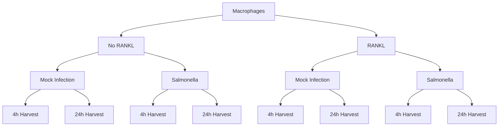

# RANKL Signaling in Macrophages

This repository contains the bulk RNA-seq analysis pipeline used to explore the effects of **RANKL signaling** on the **innate immune response** of macrophages to *Salmonella* infection. The analysis is performed in **R**, with a focus on both **differential expression** and **gene set enrichment analysis (GSEA)**.

## 🧪 Experimental Design

All samples are murine macrophages treated with either **no RANKL (0)** or **100 ng/mL RANKL** for 48 hours prior to mock infection or *Salmonella Typhimurium* (STm) infection. Cells were harvested at either **4 hours** or **24 hours** post-infection. Each condition was run in **triplicate**.



### 📊 Experimental Conditions (n = 8 groups, 3 replicates each)

- `4h_mock_0`  
- `24h_mock_0`  
- `4h_STm_0`  
- `24h_STm_0`  
- `4h_mock_100`  
- `24h_mock_100`  
- `4h_STm_100`  
- `24h_STm_100`  

---


## 🧬 Biological Objective

The main question is: **How does RANKL modulate the macrophage response to infection?**

We ask how pre‑exposure to RANKL modulates macrophage transcriptional responses to Salmonella infection and how those responses differ between 4 h and 24 h post‑infection.

Previous biological findings suggest RANKL **dampens pro-inflammatory signaling** (e.g., TLR/NF-κB pathways). This pipeline quantifies those effects at the transcriptional and pathway level, across timepoints.

---

## 🧠 Statistical Design & Contrasts

We define **specific contrasts** to isolate the biological effects of interest:
## Statistical Modelling 
To model the experiment in mathematical terms, two sets of contrasts are used:: 

#### 🧮 Defining Contrasts

1) **Pool** contrasts (effects within each timepoint/treatment combination)

```r
contrasts.p <- makeContrasts(
    STm_4h_0 = t4h_STm_0 - t4h_mock_0,
    STm_4h_100 = t4h_STm_100 - t4h_mock_100,
    RANKL_4h_mock = t4h_mock_100 - t4h_mock_0,
    RANKL_4h_STm = t4h_STm_100 - t4h_STm_0,
    STm_24h_0 = t24h_STm_0 - t24h_mock_0,
    STm_24h_100 = t24h_STm_100 - t24h_mock_100,
    RANKL_24h_mock = t24h_mock_100 - t24h_mock_0,
    RANKL_24h_STm = t24h_STm_100 - t24h_STm_0,
    levels = design
)
```
These contrasts look at **baseline** RANKL and infection effects for each timepoint.

2) **Granular** “modulation” contrasts (RANKL’s effect on infection at a timepoint and its time‑dependence)

```r
contrasts.m <- makeContrasts(
    RANKL_effect_4h = (t4h_STm_100 - t4h_mock_100) - (t4h_STm_0 - t4h_mock_0),
    RANKL_effect_24h = (t24h_STm_100 - t24h_mock_100) - (t24h_STm_0 - t24h_mock_0),
    Time_RANKL_effect = ((t24h_STm_100 - t24h_mock_100) - (t24h_STm_0 - t24h_mock_0)) -
                        ((t4h_STm_100 - t4h_mock_100) - (t4h_STm_0 - t4h_mock_0)),
    levels = design
)
```
These **granular contrasts** isolate how **RANKL** modulates infection specifically at 4h and 24h, and how that change evolves over time.

Basically speaking, the `-` sign sets the comparison between two conditions. This helps us to isolate specific biological effects we`re interested in. 

### Early infection RANKL effect 
`RANKL_effect_4h = (4h_STm_100 - 4h_mock_100) - (4h_STm_0 - 4h_mock_0)`
* This shows how RANKL changes the infection response at 4 hours
* Think of it as: "Does RANKL treatment make cells respond differently to infection (Salmonella) at 4h?"
* In mathematical terms:
    - First, we calculate infection effect with RANKL (4h_STm_100 - 4h_mock_100)
    - Then, infection effect without RANKL (4h_STm_0 - 4h_mock_0)
    - The difference between these tells us if RANKL modified the infection response
* It compares the infection response (STm vs mock) between RANKL-treated and untreated cells at 4 hours
* Identifies genes where RANKL changes the early infection response

### Late infection RANKL effect 
`RANKL_effect_24h = (24h_STm_100 - 24h_mock_100) - (24h_STm_0 - 24h_mock_0)`
* Same as above, but at 24 hours
* Answers: "Does RANKL treatment make cells respond differently to infection at 24h?"
Uses the same mathematical logic, just with 24h samples
* It compares the infection response (STm vs mock) between RANKL-treated and untreated cells at 24 hours
* Identifies genes where RANKL changes the late infection response

### RANKL time effect 
`Time_RANKL_effect = ((24h_STm_100 - 24h_mock_100) - (24h_STm_0 - 24h_mock_0)) - ((4h_STm_100 - 4h_mock_100) - (4h_STm_0 - 4h_mock_0))`
* This shows how the RANKL effect on infection changes between 4h and 24h
* Answers: "Does RANKL's impact on infection response change over time?"
* Mathematically:
    - Calculate RANKL effect at 24h
    - Calculate RANKL effect at 4h
    - Subtract to see if the effect changes over time
* Identifies genes where RANKL's modification of the infection response differs between early and late timepoints
* Positive values indicate genes where RANKL's effect on infection response is stronger at 24h
* Negative values indicate genes where RANKL's effect on infection response is stronger at 4h


Rationale for not using a single unified “time × treatment × RANKL” model as the primary inferential frame:

- PCA and heatmaps showed 24 h samples cluster distinctly in a way consistent with medium deprivation stress, a design‑coupled artifact not orthogonal to biological time. Because all 24 h samples share that stress, adding “time” as a single factor does not isolate this confounder; it risks attributing starvation‑driven shifts to temporal biology. We therefore treated 4 h and 24 h comparisons symmetrically via pre‑specified contrasts and emphasized interpretation within each timepoint. In the code I have left the explicit time‑interaction contrast (`Time_RANKL_effect`) but caution that it aggregates signal that likely includes medium‑deprivation effects.

---

## 🧰 Pipeline Overview


## High‑level pipeline

```
┌─────────────────────────┐    ┌──────────────────────┐     ┌───────────────────────────┐
│ Raw counts (genes × N) │    │ Sample metadata      │     │ R packages                 │
│ 0_Data/STAR_Data/      │    │ seq_reference.txt    │     │ edgeR, limma, clusterProf.│
└─────────────┬──────────┘    └──────────┬───────────┘     └──────────┬────────────────┘
              │                           │                            │
              ▼                           ▼                            ▼
       process_rnaseq_data()  →  DGEList (filtered + TMM‑normalized; factors: timepoint, treatment, rankl, group)
              │
              ▼
   Design (~ 0 + group) + Contrasts  →  voomLmFit(sample.weights=TRUE) → contrasts.fit → eBayes(robust=TRUE)
              │
              ├─────────────────────────────────────────────────────────────────────────────────┐
              ▼                                                                                 ▼
      "Pooled" GSEA branch                                                           "Granular questions" branch
   (all contrasts; pool pathways)                                                  (specific contrasts/timepoints)
              │                                                                                 │
              ▼                                                                                 ▼
   topTable per contrast (t‑stat ranking)                                            DE tables per contrast
              │                                                                                 │
              ▼                                                                                 ▼
   runGSEA() over multiple MSigDB databases                                           runGSEA() per database
              │                                                                                 │
              ▼                                                                                 ▼
   get_significant_pathways() across contrasts                                         GSEA_dotplot (NES±),
   get_pathway_genes_all() (core genes by p.adjust min)                                GSEA_barplot (NES),
   calculate_pathway_scores() (mean log‑CPM)                                           GSEA_dotplot_facet (NES±)
              │                                                                                 │
              ▼                                                                                 ▼
   Pathway‑level heatmaps (scores)                                                    Optional gene‑level heatmaps
   (pheatmap; annotations; fixed column order)                                        for specific pathways
```

### 1. **Environment Setup**
Scripts are modularized under `1_Scripts/`:
- `Load_libraries.R`: Loads required packages
- `process_rnaseq_data.R`: Creates `DGEList` and normalizes counts
- `PCA.R`: Generates PCA plots
- GSEA and visualization tools: `runGSEA.R`, `GSEA_dotplot.R`, `runningSumGSEAplot.R`, `combined_volcano.R`, etc.

---

### 2. **Data Preparation**
- Reads **count matrix** and **sample metadata**
- Constructs a `DGEList` for downstream analysis
- Runs **PCA** to assess sample clustering

---

### 3. **Differential Expression Analysis**
- We defined various contrasts adressing specific questions (see Statistical Modelling explanation above)
- Performed standard DE analysis using `edgeR::voomLmFit` with `sample.weights = TRUE`

---

### 3. **Pooled GSEA Analysis**

To inspect the changes across global pattern we performed pooled GSEA. The logic of the pooled GSEA analysis is described below.


### 📈 Running Pooled GSEA

```r
pooled_gsea_results <- run_pooled_gsea(fit, contrasts.p, DGErankl)
```

**What does `run_pooled_gsea()` do?**  
- Iterates over each contrast (e.g., `RANKL_effect_4h`, `RANKL_effect_24h`), then:
  1. **Extracts differentially expressed genes** using `topTable()`.
  2. **Runs GSEA** on the ranked gene list (t-statistic) via `runGSEA()` using MSigDB references (Hallmark, KEGG, GO:BP, Reactome).
  3. Collects significant pathways from each contrast and **merges** them into a pooled set.
  4. Retrieves the corresponding **core genes** for these pathways using `get_pathway_genes_all()`.
  5. **Normalizes** counts (`norm_counts`) and **calculates pathway scores** by averaging gene expression for each pathway.

**Key outputs**:
- **`gsea_results`**: Full GSEA results (by contrast and database).
- **`pools`**: List of significantly enriched pathways across all contrasts.
- **`genes`**: Genes in each enriched pathway, per database.
- **`scores`**: Sample-by-pathway score matrix for heatmaps.

**Goal**:  
Perform GSEA across multiple contrasts and **aggregate** significant pathways and genes.

**Function chain**:  
1. `topTable()` → pulls DE genes per contrast  
2. `runGSEA()` → runs enrichment with `clusterProfiler` & MSigDB  
3. `get_significant_pathways()` → extracts top pathways across contrasts  
4. `get_pathway_genes_all()` → collects core genes for top pathways  
5. `calculate_pathway_scores()` → computes average expression per pathway

---

### 🧠 Supporting Functions Breakdown

- **`run_pooled_gsea()`**  
  - Loops over contrasts → runs GSEA → retrieves genes → computes scores  
  - Returns GSEA results, significant pathways, and pathway scores  

- **`runGSEA()`**  
  - Runs GSEA using `clusterProfiler` on a ranked list (t-statistic)  
  - Supports multiple MSigDB categories (Hallmark, KEGG, GO:BP, Reactome)

- **`get_pathway_genes()`**  
  - Extracts core enrichment genes from top significant pathways (by adjusted p-value)  

- **`get_pathway_genes_all()`**  
  - Aggregates pathway genes across all contrasts, ranking by minimum adjusted p-value  

- **`get_significant_pathways()`**  
  - Returns all pathways passing a specified FDR cutoff

- **`calculate_pathway_scores()`**  
  - For each pathway, selects its genes and averages their expression per sample  
  - Outputs a “samples × pathways” score matrix

---

## 🧩 Key Functions Explained

| Function                          | Description                                                                      |
|----------------------------------|----------------------------------------------------------------------------------|
| **`runGSEA()`**                  | Runs GSEA using a ranked gene list (e.g., t-statistics) and MSigDB categories.   |
| **`run_pooled_gsea()`**          | Applies `runGSEA()` to multiple contrasts and compiles pooled results.           |
| **`get_pathway_genes()`**        | Retrieves top significant pathways and their core enrichment genes.              |
| **`calculate_pathway_scores()`** | Computes average expression of pathway genes per sample.                         |
| **`create_volcano_plot()`**      | Generates volcano plots with labeling and threshold options.                     |
| **`plot_pathway_heatmap()`**     | Plots expression heatmaps with metadata annotations.                             |
| **`create_combined_volcano_plots()`** | Merges multiple volcano plots into a single visualization.               |


## GSEA strategies and philosophy

We deploy two complementary GSEA tracks:

- **Pooled GSEA** (broad landscape): run GSEA for every contrast in `contrasts.p` across multiple databases; pool significant pathways across contrasts; extract core genes per pooled pathway; compute pathway scores (per sample) as average expression of core genes. This yields compact heatmaps capturing recurring pathway programs.

- **Granular GSEA** (focused questions): for targeted contrasts (`RANKL_effect_4h`, `RANKL_effect_24h`, `Time_RANKL_effect`), rank by moderated t, run GSEA per database, and visualize directionality (NES sign), magnitude (NES), significance (q‑value), and gene coverage (GeneRatio).

**Why pool?**

- Pooling stabilizes pathway selection against single‑contrast findings, highlighting pathways that recur or show strong evidence in at least one contrast. It supports downstream summarization (pathway scores) and interpretable heatmaps spanning all samples.

---

## Script interoperation (who calls whom and what flows where)

```
topTable() per contrast (moderated t)
   │  (rank by t)
   ▼
runGSEA()  [msigdbr gene sets; fgsea backend; nPermSimple = 100000]
   │  outputs gseaResult (with ID, Description, NES, p.adjust/qvalue, core_enrichment, setSize)
   ├─────────────────────────────┬───────────────────────────────────────────────────────────────────────┐
   ▼                             ▼                                                                       ▼
runGSEA_pool.R             get_significant_pathways.R                                                run_GSEA_analysis.R
   │                       (collect IDs with q < 0.01 across contrasts)                                  │
   │                                                                                                      │
   ▼                                                                                                      ▼
get_pathway_genes_all.R                                                                                    GSEA_dotplot.R
   ├─ parse core_enrichment to gene lists per pathway (p.adjust < 0.01)                                    • X = GeneRatio (= #core genes / setSize)
   ├─ deduplicate by pathway ID across contrasts                                                           • Y = pathway Description
   └─ rank by min p.adjust across contrasts; take top N                                                    • Color = NES sign (±), Size = -log10(q)
   │                                                                                                      • Filters: NES_positive / NES_negative / qvalue
   ▼                                                                                                      
calculate_pathway_scores.R                                                                                 GSEA_barplot.R
   • For each pooled pathway, subset expression (logCPM),                                                  • Bars = NES (signed)
     compute per‑sample mean across genes                                                                  • Order by NES (↑ or ↓), color by NES>0
   │                                                                                                      
   ▼                                                                                                      GSEA_dotplot_facet.R
Heatmaps of pathway scores (pheatmap)                                                                      • Facets by direction; X = |NES|; Size = -log10(q)
```

Key files and functions:

- `runGSEA.R`: prepares ranked vector (names = gene symbols; values = moderated t), collects MSigDB sets with `msigdbr(species, collection=category, subcollection=subcategory)`, runs `clusterProfiler::GSEA` with `by = "fgsea"`, `pAdjustMethod = "fdr"`, `nPermSimple = 100000`.
- `runGSEA_pool.R`: loops all pool contrasts, runs `runGSEA` for Hallmark, KEGG, GO:BP, and Reactome (pvalueCutoff 0.01), aggregates significant pathway IDs (`get_significant_pathways`), extracts pathway core genes across contrasts (`get_pathway_genes_all`), computes per‑sample pathway scores (`calculate_pathway_scores`) from `cpm(DGErankl, log=TRUE)`.
- `get_significant_pathways.R`: from a list of `gseaResult` objects, return unique pathway IDs with `p.adjust < q_cutoff` (default 0.01).
- `get_pathway_genes.R`: for a single `gseaResult`, select top N pathways by adjusted p (default q < 0.01), parse `core_enrichment` to gene symbols.
- `get_pathway_genes_all.R`: across contrasts, collect core genes for each pathway with `p.adjust < 0.01`, deduplicate by pathway ID, compute min adjusted p across contrasts per pathway, and optionally keep top N.
- `calculate_pathway_scores.R`: for each pathway gene set, intersect with expression matrix rows and compute the column‑wise mean (per sample). Output: samples × pathways matrix of average log‑CPM.
- `run_GSEA_analysis.R`: “granular” driver. Iterates a configured set of MSigDB categories (`db_configs`) and, for each: runs `runGSEA` on the DE table; emits three plots (dotplot positive, dotplot negative, NES barplot) and one faceted dotplot; returns a list of `gseaResult` objects by database. Parameters mirror those used in `Analysis.R` (rank by t, `nperm = 100000`, `q_cut = 0.05`).

---


## Plotting functions and what they visualize

- PCA (`PCA.R::create_pca_plot`): 2D PCA of samples over logCPM; point color = `group`; labels = group; axis labels display % variance explained. Saved to `3_Results/imgs/PCA/`.

- Volcano plots
  - `standard_volcano.R::create_volcano_plot`
    - X = log2 fold change (`logFC`), Y = −log10 p‑value (`P.Value`).
    - Thresholds: dashed lines at p‑value cutoff (default 0.05) and |log2FC| cutoff (default 2.0).
    - Color encodes significance categories: p‑value only, FC only, both, or NS; labels controlled by `label_method` and `max.overlaps`.
    - Used in `Analysis.R` for: 4 h, 24 h, and time‑interaction; saved to `3_Results/imgs/volcano/`.
  - `combined_volcano.R::create_combined_volcano_plots`
    - Builds 3 volcano plots (4 h, 24 h, 24 vs 4) with common axis limits for fair visual comparison; outputs a single PDF (landscape panel).

- GSEA dotplot (`GSEA_dotplot.R::GSEA_dotplot`)
  - Input: `gseaResult`.
  - Computes `GeneRatio = # core_enrichment genes / setSize` per term.
  - Filters by `qvalue < q_cut` (e.g., 0.05 in `Analysis.R`).
  - Encodings: X = `GeneRatio`; Y = term; dot size = −log10(qvalue); dot color = NES sign (positive/negative).
  - Supports `filterBy = "NES_positive"` and `"NES_negative"` to show up‑ or down‑regulated pathways separately (as used in `run_GSEA_analysis.R`).

- GSEA faceted dotplot (`GSEA_dotplot_facet.R::GSEA_faceted_dotplot`)
  - Splits significant pathways into Upregulated (NES > 0) and Downregulated (NES < 0) facets.
  - Encodings: X = |NES|; Y = term; dot size = −log10(qvalue).
  - Sorting configurable by `GeneRatio`, `qvalue`, or `NES`; `showCategory` limits items per facet.

- GSEA NES barplot (`GSEA_barplot.R::GSEA_barplot`)
  - Selects up to `top_n` significant pathways (q < `q_cut`) ordered by |NES|.
  - Encodings: Y (horizontal axis after flip) = term; bar length = NES; bar color indicates NES > 0 (up) vs NES < 0 (down).
  - Title and database‑specific figure sizes set by caller; used in `run_GSEA_analysis.R` with `top_n = 3 × showCategory`.

- GSEA running‑sum plot (`runningSumGSEAplot.R::runSumGSEAplot`)
  - Wrapper over `enrichplot::gseaplot2` to show the enrichment running‑sum curve, ranked list heatmap, and tick marks for selected gene sets.
  - Typical usage in `Analysis.R`: `subplots = c(1,2,3)` for composite view; saved to `3_Results/imgs/RunSum/`.

- Pathway heatmaps
  - Pooled pathway scores: in `Analysis.R`, `plot_pathway_heatmap(scores, ...)` (inline helper) draws heatmaps of transposed score matrices (`t(scores)`), `scale = "row"`, fixed sample order, column annotations (`Time`, `Treatment`, `RANKL`), optional visual gaps to separate groups. Color scale: blue‑white‑red.
  - Single‑pathway gene heatmaps: `plot_single_pathway_heatmap.R::plot_single_pathway_heatmap`
    - Finds a term in a `gseaResult` by `Description`/`ID` (partial match), parses `core_enrichment` genes, subsets the normalized expression matrix, and plots a gene‑level heatmap with optional annotations and sample order. Filename includes timepoint and pathway ID.

Parameterization (as called from `2_Analysis/Analysis.R`):

- Ranking metric for GSEA: moderated t‑statistic (`rank_metric = "t"`).
- GSEA engine: `clusterProfiler::GSEA(..., by="fgsea", nPermSimple=100000, pAdjustMethod="fdr")`.
- Significance: pooled GSEA uses `p.adjust < 0.01` for pooling; granular plots use `q_cut = 0.05`.
- Databases: Hallmark (H), KEGG (C2:CP:KEGG / KEGG_LEGACY), Reactome (C2:CP:REACTOME), GO (C5:BP/CC/MF), and additional collections (e.g., C3:TFT). Selection is specified in `db_configs` where used.

---

## Outputs

- DE tables: `3_Results/DE_tables/DE_rankl_4h.csv`, `DE_rankl_24h.csv`, `DE_rankl_time.csv`.
- Volcano plots: `3_Results/imgs/volcano/*.pdf` (single and combined triptych).
- Pooled GSEA heatmaps: `3_Results/imgs/GSEA/A.Pair‑wise comparisons/*_heatmap.pdf`.
- Granular GSEA plots (per DB/timepoint): `3_Results/imgs/GSEA/B.Granular_questions/` and `C.4_24h_RANKL_separate/`.
- Single‑pathway gene heatmaps: `3_Results/imgs/GSEA/.../Pathways/*.pdf`.


---

# Follow-up analyses

## Follow-up №1: Potential caveats, adressing collaborator questions 

After reviewing initial results, our collaborator raised the following points:

> 1. **Time-Dependent Changes Confounding**: Our collaborator expressed concern that serum starvation at 24h could confound interpretation of time effects.  
> 2. **Targeted Pathway Insights**: Desire to see which pathways RANKL specifically up- or down-regulates in *Salmonella*-infected cells at each timepoint (4h vs. 24h).

#### Our Response
1. **Time-Dependent (Batch) Effects**  
   - Acknowledged potential batch/confounding issues (e.g., serum starvation).  
   - Given the experimental design, we cannot fully correct for it in this dataset.  
   - Emphasized cautious interpretation of 4h vs. 24h comparisons.

2. **Pathways Specifically Up-/Down-Regulated by RANKL**  
   - Implemented additional code to produce **separate dotplots** for up- and down-regulated pathways, based on the NES sign.  
   - Created **barplots** of NES values to highlight which pathways RANKL is modulating.

#### Code for Focused RANKL vs. Infection Pathway Analysis

`run_gsea_analysis` is a code snippet that addresses these concerns. It creates separate **dotplots** and **barplots** to show which pathways are *upregulated* or *downregulated* by RANKL in *Salmonella*-infected cells, separate at both 4h and 24h. It uses the existing `runGSEA` infrastructure, filtering by **NES** sign and p-value thresholds.


#### Interpretation

- **Upregulated Pathways**: Appear in the “NES positive” dotplot. Higher NES values suggest a stronger positive effect of RANKL on that pathway under *Salmonella* infection at the specified timepoint.  
- **Downregulated Pathways**: Appear in the “NES negative” dotplot. These are pathways suppressed by RANKL.  
- **Barplots**: Provide a quick comparison of NES values for the top significant pathways, allowing you to see relative enrichment.

This approach answers the request for clearer insights into **which pathways RANKL might up- or downregulate in infected cells** at each timepoint. 

---

## Follow-up №2: Additional plots per collaborators request

Our collaborators requested deeper insight into the actual **genes** driving those pathway enrichments.

* From the 4h KEGG downregulated pathways, “TOLL LIKE RECEPTOR SIGNALING PATHWAY”
* From the 4h GO BP downregulated pathways:
    * “GOBP RESPONSE TO MOLECULE OF BACTERIAL ORIGIN”, 
    * “GOBP CELLULAR RESPONSE TO BIOTIC STIMULUS”, 
    * “GOBP CELLULAR RESPONSE TO MOLECULE OF BACTERIAL ORIGIN”
* From the 4h GO BP upregulated pathways:
    * “GOBP NEGATIVE REGULATION OF UBIQUITIN PROTEIN LIGASE ACTIVITY”

To get these heatmaps we\`ve developed **`plot_single_pathway_heatmap()`**, which: 
- Identifies a **single** pathway from a GSEA result object (e.g., `gseaResult` from `clusterProfiler`).  
- Extracts the **core enrichment genes** that contribute to that pathway’s enrichment.  
- Subsets the **normalized expression matrix** (e.g., `log-CPM`) to those genes.  
- Generates a **heatmap** of gene expression values across samples, with optional row/column annotations.

### Function Arguments

- **`gsea_obj`**: A single GSEA result object from `clusterProfiler` (class `gseaResult`).  
- **`pathway_name`**: The name (or partial name) of the pathway in the GSEA table. The function searches both `Description` and `ID` fields.  
- **`expression_data`**: A matrix (or data frame) of normalized gene expression values (`log-CPM`, `log2 TPM`, etc.). Rows = genes, columns = sample IDs.  
- **`sample_order`**: A character vector specifying the order of the sample columns in the heatmap.  
- **`annotation_col`** & **`annotation_colors`**: Optional metadata for sample annotation bars (e.g., timepoint, treatment).  
- **`output_prefix`**: File path prefix for saving the PDF (e.g., `"4h_KEGG_downregulated"`).  
- **`scale_expr`**: Scaling parameter passed to **pheatmap** (`"row"`, `"none"`, etc.).  

```r
# Suppose we have:
# res_4h <- run_gsea_analysis(DE_rankl_4h, "4h")
# res_4h$KEGG is the gseaResult object for KEGG at 4h
# norm_counts is our normalized expression data
# sample_order is a vector of sample IDs in the desired order

plot_single_pathway_heatmap(
  gsea_obj = res_4h[["KEGG"]],
  pathway_name = "KEGG_TOLL_LIKE_RECEPTOR_SIGNALING_PATHWAY",
  expression_data = norm_counts,
  sample_order = sample_order,
  annotation_col = annotation_col,
  annotation_colors = ann_colors,
  output_prefix = "4h_KEGG_TLR_Heatmap"
)
```

This will create a heatmap PDF named something like **`4h_KEGG_TLR_Heatmap_KEGG_TOLL_LIKE_RECEPTOR_SIGNALING_PATHWAY.pdf`** in your working directory, showing the core genes that contributed to that pathway’s enrichment at 4h.

### Notes & Tips

- **Pathway Matching**: If you see “No matching pathway found,” verify the exact string in either the `Description` or `ID` column of your GSEA results. Some might contain fewer underscores or different spellings.
- **Font Sizing**: If the row or column labels are still crowded, reduce `fontsize_row` or `fontsize_col` further, or use `scale_expr = "none"` if row-scaling isn’t desired.
- **Cluster Columns**: We disable column clustering (`cluster_cols = FALSE`) to preserve the sample order. For data-driven clustering of columns change `cluster_cols = TRUE`.
- **File Naming**: The function automatically strips non-alphanumeric characters from the pathway name to avoid file system issues.

---

### General Intuition of the analysis

In discussions with our lab members and our collaborator, I decided to provide this explanation into the general intuition of what we did. I decided to leave here it for the record and for the time being. 

**Part 1: Differential Expression and GSEA**
We performed DE analysis separately for 4h and 24h using the contrasts:

* 4h:
```
RANKL_effect_4h = (t4h_STm_100 - t4h_mock_100) - (t4h_STm_0 - t4h_mock_0)
```

* 24h:
```
RANKL_effect_24h = (t24h_STm_100 - t24h_mock_100) - (t24h_STm_0 - t24h_mock_0)
```

From each contrast, we obtained a ranked list of differentially expressed genes (DEGs), which we then used as input for GSEA—run separately for 4h and 24h.
The output from GSEA (e.g., bubble plots and NES bar plots) tells us which pathways are enriched or downregulated in response to RANKL under infection, compared to baseline. This gives a more global view, showing if a particular pathway is at all enriched at the timepoint. 
This part of the analysis gives us bubble plots and the NES barplots. You should check those, if you`re interested if the pathway was enriched at some particular timepoint. 

**Part 2: Heatmaps and Expression Patterns**
Once enriched pathways are identified, the next question becomes: how do these pathways actually "behave" across conditions and timepoints?
To answer that, we generate heatmaps showing expression of genes in those pathways. There are two types of heatmaps we use:

**1. Pathway-level Heatmaps (Average Expression):**
For a selected pathway, we take the core gene set (i.e., the most contributing genes from GSEA), extract their normalized expression values (e.g., log-transformed read counts) per sample, and compute the mean expression across all genes in that set. This gives us a single average expression value per sample for the pathway.

**2. Gene-level Heatmaps:**
Here, instead of summarizing the entire pathway into one number, we display the normalized expression for each gene in the pathway across all samples. This allows us to visualize individual gene "behavior" within the pathway.
In both cases, we then standardize the expression values using z-scores. This means each gene’s expression is scaled relative to its own mean and variability across the selected samples.
In combined 4h+24h heatmaps, z-scoring is done across all samples (4h and 24h), so color patterns reflect differences across timepoints.
In separate 4h and 24h heatmaps, z-scoring is done within each timepoint, which supposedly should help reveal timepoint-specific expression patterns that may otherwise be masked.

**To summarize:**

GSEA uses differential expression stats to show which pathways are enriched.
Pathway heatmaps show the average normalized expression (log2-counts) across genes in a pathway.
Gene-level heatmaps show the expression (log2 counts) of individual genes within that pathway.

This basically means even if a pathway like TLR signaling isn't significantly enriched at 24h, we can still visualize its gene expression to explore biological relevance beyond strict significance thresholds. TLR and Bacterial response pathway are not significantly enriched at 24h timepoint, yet we still can visualise their expression levels just by looking at the same genes expression levels.

## 🖼️ Output Files

All plots and tables are saved under:

```
3_Results/
  ├── DE_tables/                   # Differential expression results
  ├── imgs/
      ├── GSEA/
          ├── A.Pair-wise comparisons/  # Heatmaps from pooled GSEA
          ├── B.Granular_questions/     # Dotplots, heatmaps, and GSEA enrichment plots for specific contrasts
          ├── C.4_24h_RANKL_separate/     # Separate GSEA plots for 4h and 24h, respectively 
                ├── Pathways/     # Core genes heatmaps for pathways of interest 
```

---


