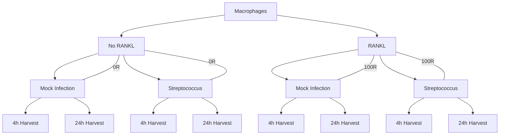

# RANKL singaling in macrophages

## Experiment structure:
The samples are all macrophages that received no RANKL (0R) or RANKL (100R) for 2 days prior to mock infection (M) or Salmonella infection (S). They were either infected for 4h or 24h before samples were harvested. 



So there were total 8 experimental conditions. 

* 0R-M-4h 
* 0R-M-24h
* 0R-S-4h
* 0R-S-24h
* 100R-M-4h
* 100R-M-24h
* 100R-S-4h
* 100R-S-24h
An each condition had 3 technical replicates

## Preprocessing 
Preprocessing was done before by a PhD student using Kallisto / Sleuth-normalization. We are considering rerunning the pipeline with STAR. 


## Main interest:
The main interest is how RANKL impacts the innate immune response to infection. Biologically, I have seen decreases in TLR and NFkB pathways, and associated decreases in proinflammatory cytokines.

## Statistical Modelling 
To model the experiment in mathematical terms, I`m going to set the following contrasts: 
```
RANKL_effect_4h = (S.100R.4h - M.100R.4h) - (S.0R.4h - M.0R.4h),
RANKL_effect_24h = (S.100R.24h - M.100R.24h) - (S.0R.24h - M.0R.24h),
Time_RANKL_effect = ((S.100R.24h - M.100R.24h) - (S.0R.24h - M.0R.24h)) -  ((S.100R.4h - M.100R.4h) - (S.0R.4h - M.0R.4h)),
```
Basically speaking, the `-` sign sets the comparison between two conditions. This helps us to isolate specific biological effects we`re interested in. 

### Early infection RANKL effect 
`RANKL_effect_4h = (S.100R.4h - M.100R.4h) - (S.0R.4h - M.0R.4h)`
* This shows how RANKL changes the infection response at 4 hours
* Think of it as: "Does RANKL treatment make cells respond differently to infection (streptococcus) at 4h?"
* In mathematical terms:
    - First, we calculate infection effect with RANKL (S.100R.4h - M.100R.4h)
    - Then, infection effect without RANKL (S.0R.4h - M.0R.4h)
    - The difference between these tells us if RANKL modified the infection response

### Late infection RANKL effect 
`RANKL_effect_24h = (S.100R.24h - M.100R.24h) - (S.0R.24h - M.0R.24h)`
* Same as above, but at 24 hours
* Answers: "Does RANKL treatment make cells respond differently to infection at 24h?"
Uses the same mathematical logic, just with 24h samples

### RANKL time effect 
`Time_RANKL_effect = ((S.100R.24h - M.100R.24h) - (S.0R.24h - M.0R.24h)) - ((S.100R.4h - M.100R.4h) - (S.0R.4h - M.0R.4h))`
* This shows how the RANKL effect on infection changes between 4h and 24h
* Answers: "Does RANKL's impact on infection response change over time?"
* Mathematically:
    - Calculate RANKL effect at 24h
    - Calculate RANKL effect at 4h
    - Subtract to see if the effect changes over time


